 
<div align="center">


<a href="https://git.io/typing-svg">
  
</a>

<br/>




<br/><br/>

<a href="https://www.linkedin.com/in/ashish-more-878a2a304"></a>
<a href="mailto:ashishmore2704@gmail.com"></a>
<a href="https://github.com/Ashishmore788"></a>

<br/><br/>


</div>

<br/>

---

## 🧠 About Me


I'm a **Data Analyst / MIS Analyst / Data Scientist** currently working as an **IT Officer at HDFC Bank**, with a strong foundation in data analytics, MIS reporting, and machine learning.

- 📊 I build **MIS reporting systems and dashboards** that cut manual reporting time by ~30% and report turnaround by 40%
- 🤖 I develop **end-to-end ML pipelines** for real-world prediction problems (churn, attrition, admissions)
- 📈 I work extensively with **Power BI, DAX, and Advanced Excel (VBA, Macros)** for business intelligence
- 🏦 I coordinate **application deployments and operational reporting** in a banking environment
- 🌱 Currently building an **MIS Automation Dashboard** combining Python, PostgreSQL, and Power BI

**💼 Open To:** Data Analyst Roles · MIS Analyst Roles · Data Scientist Roles · Business Intelligence Opportunities

<br clear="right"/>

---

## 🛠️ Tech Stack

**Languages & Databases**
<p>  </p>

**ML & Data Science**
<p>    </p>

**BI & Visualization**
<p>    </p>

**MIS & Excel**
<p>   </p>

**Tools**
<p>  </p>

---

## 📊 Skills Snapshot

<div align="center">

| Domain | Highlights |
|---|---|
| **MIS & Analytics** | KPI/SLA tracking, variance analysis, ETL, data reconciliation, dashboard reporting |
| **Machine Learning** | Scikit-learn, XGBoost, TensorFlow, EDA, feature engineering, NLP |
| **BI & Visualization** | Power BI, DAX, Tableau, Matplotlib, Seaborn |
| **Database** | SQL, MySQL, ETL pipelines, data cleaning, statistical analysis |
| **Other** | Stakeholder management, A/B testing, hypothesis testing |

</div>

---

## 💼 Experience

### IT Officer — HDFC Bank, Mumbai
**Mar 2026 — Present**

- Coordinated end-to-end application deployment activities — release scheduling, system updates, and post-deployment verification — ensuring zero-downtime rollouts across production environments
- Designed and managed Excel-based tracking systems for deployment logs, issue registers, and operational status reports using Pivot Tables and formulas, reducing manual reporting time by ~30%
- Generated and optimized Excel reports for team and management visibility using filters, VLOOKUP, and INDEX MATCH, reducing report turnaround time by 40%

`Excel VBA` `Pivot Tables` `MIS Reporting` `SQL` `Stakeholder Management`

---

## 🚀 Featured Projects

<details open>
<summary><b>🔹 Customer Churn Prediction</b></summary>
<br/>

End-to-end ML pipeline on 10,000+ records predicting customer churn.

| Attribute | Detail |
|---|---|
| **Stack** | Python, XGBoost, Scikit-learn, Pandas, Matplotlib |
| **Performance** | 87% accuracy, 0.91 AUC-ROC |
| **Insights** | Top churn drivers (contract type, tenure, charges) identified via feature importance |

Built with thorough data cleaning and ROC curve analysis to validate model performance.

</details>

<details>
<summary><b>🔹 HR Analytics Dashboard — Attrition Analysis</b> — <a href="https://github.com/Ashishmore788/HR-Analytics-PowerBI">View Repo ↗</a></summary>
<br/>

Multi-page Power BI dashboard tracking employee attrition.

| Attribute | Detail |
|---|---|
| **Stack** | Power BI, DAX, Excel |
| **Scale** | 15+ KPIs across 1,400+ employee records |
| **Highlights** | Custom DAX measures for attrition rate, tenure, and satisfaction scores |

Supports business intelligence decisions around workforce retention.

</details>

<details>
<summary><b>🔹 Nike Sales Analysis</b></summary>
<br/>

12-month sales analysis across 8 states.

| Attribute | Detail |
|---|---|
| **Stack** | Advanced Excel, Pivot Tables, VLOOKUP, INDEX MATCH |
| **Findings** | Footwear = 42% revenue share |
| **Impact** | Data-driven strategy cut overstock by 18% |

Combined data cleaning with statistical analysis to shape inventory strategy.

</details>

<details>
<summary><b>🔹 MIS Automation Dashboard</b> — <a href="https://github.com/Ashishmore788/MIS-Automation-Dashboard">View Repo ↗</a> — <i>in progress</i></summary>
<br/>

Automating the MIS report cycle end-to-end.

| Attribute | Detail |
|---|---|
| **Stack** | Python, PostgreSQL, Power BI |
| **Focus** | KPI tracking, SLA compliance, and TAT variance analysis |

Combines a Python/PostgreSQL data pipeline with a Power BI dashboard for stakeholder reporting.

</details>

<details>
<summary><b>🔹 AI Sentiment Analyzer</b> — <a href="https://github.com/Ashishmore788/sentiment-analyzer">View Repo ↗</a></summary>
<br/>

Full-stack NLP app that classifies text sentiment in real time using transformer models.

| Attribute | Detail |
|---|---|
| **Stack** | Python, FastAPI, React, Hugging Face Transformers |
| **Focus** | Real-time inference API paired with a React front end |
| **Topics** | NLP, sentiment analysis, AI |

</details>

<details>
<summary><b>🔹 Monocular Visual Odometry, Segmentation & Depth Fusion</b> — <a href="https://github.com/Ashishmore788/monocular-vo-segmentation-depth-fusion">View Repo ↗</a></summary>
<br/>

Real-time 3D scene understanding system built from monocular video alone.

| Attribute | Detail |
|---|---|
| **Stack** | Python, Computer Vision |
| **Focus** | Fuses visual odometry, semantic segmentation, and depth estimation into a single scene-understanding pipeline |

</details>

<details>
<summary><b>🔹 Admission Prediction</b> — <a href="https://github.com/Ashishmore788/admission-prediction">View Repo ↗</a></summary>
<br/>

Deep learning model predicting a student's chance of graduate admission from academic and profile features.

| Attribute | Detail |
|---|---|
| **Stack** | Python, TensorFlow, Keras, Pandas, NumPy, Scikit-learn, Matplotlib |
| **Focus** | Regression modeling on academic profile data |

</details>

<details>
<summary><b>🔹 Online Marketplace for Handcrafted Goods</b> — <a href="https://github.com/Ashishmore788/Online-marketplace-for-handcrafted-goods">View Repo ↗</a></summary>
<br/>

A web application connecting artisans with buyers of handcrafted goods.

| Attribute | Detail |
|---|---|
| **Type** | Web Application |

</details>

<details>
<summary><b>🔹 Portfolio Website</b> — <a href="https://github.com/Ashishmore788/Portfolio">View Repo ↗</a></summary>
<br/>

Personal portfolio site showcasing projects and skills.

| Attribute | Detail |
|---|---|
| **Stack** | HTML |

</details>

---

## 📜 Education & Certifications

**Education**
- BSc Information Technology — Viva College of Arts, Commerce & Science, Virar | CGPA: 7.47 | Jun 2022 – May 2025
- Data Analysis & Data Science with AI & ML — IT Vedant Institute

**Certifications**


---

## 🌐 Languages

English (Professional) · Hindi (Fluent) · Marathi (Native)

---

## 📊 GitHub Analytics

<div align="center">


</div>

---

## 🎯 Current Focus

```yaml
current_focus:
  learning:
    - Advanced SQL & data pipeline automation
    - Deeper Power BI / DAX modeling
    - NLP applications in analytics
  building:
    - MIS Automation Dashboard (Python + PostgreSQL + Power BI)
  exploring:
    - A/B testing & hypothesis-driven analytics
    - Applied ML for business forecasting
  open_to:
    - Data Analyst roles
    - MIS Analyst roles
    - Data Scientist roles
```

<div align="center">
<br/>

</div>